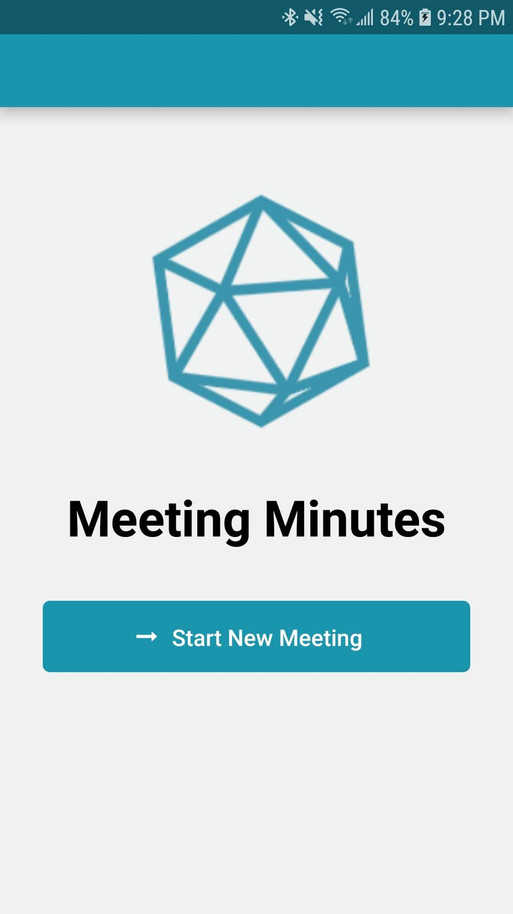
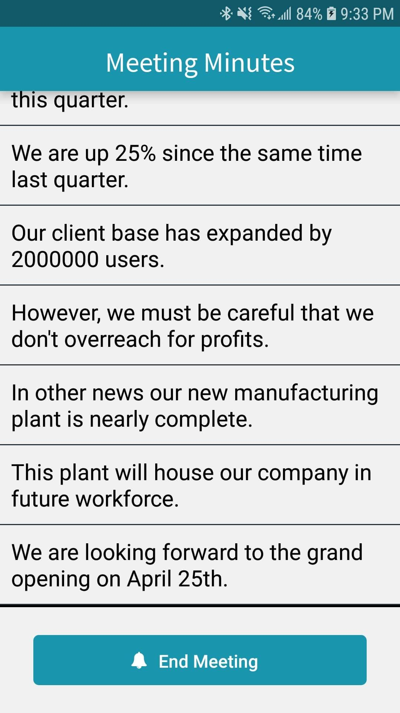
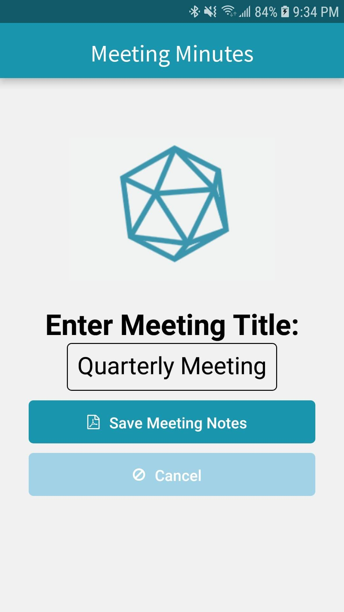
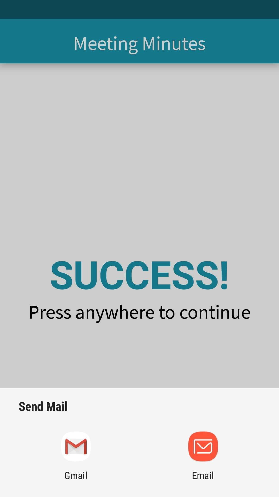
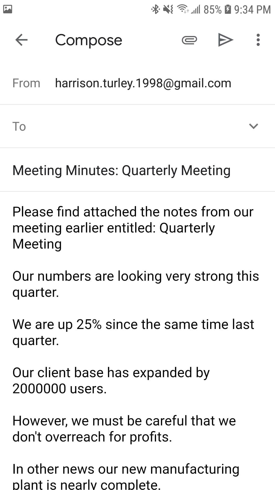

# Meeting Minutes 

This project is a continuation of my team's nwHacks 2019 project.  The premise is to provide an easy way to create a transcript of a meeting.  This project was created with React-Native, Java native code, and Azure speech-to-text.
# Inspiration 
It is common to assign a person to take notes during important meetings to ensure everyone leaves the meeting with the same information.  However, this is costly and takes the notetaker away from their normal duties.  Thus, in nwHacks 2019, my team set out to create Meeting Minutes.
# Purpose
Provide an automated meeting transcriber for organizations to use.
# Challenges
During the hackathon, we ran into numerous issues with getting React-Native to properly eject and run native Android Java modules.  As such, I chose to continue this project to completion as a personal project.
# What's Next
Several features could be implemented in the future for this project, such as Azure Speaker Recognition and database integration.  
# Screenshots
    
